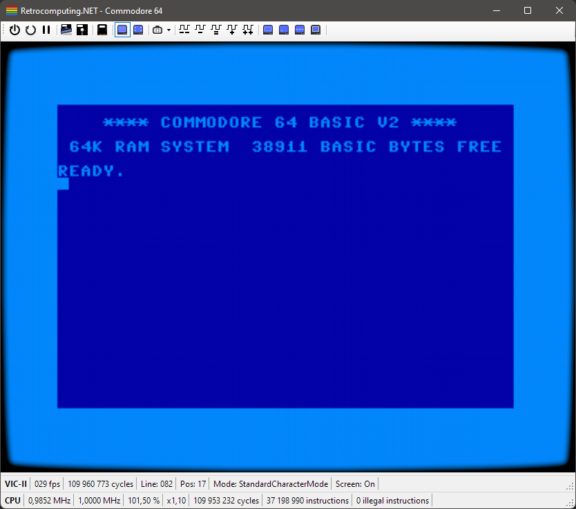
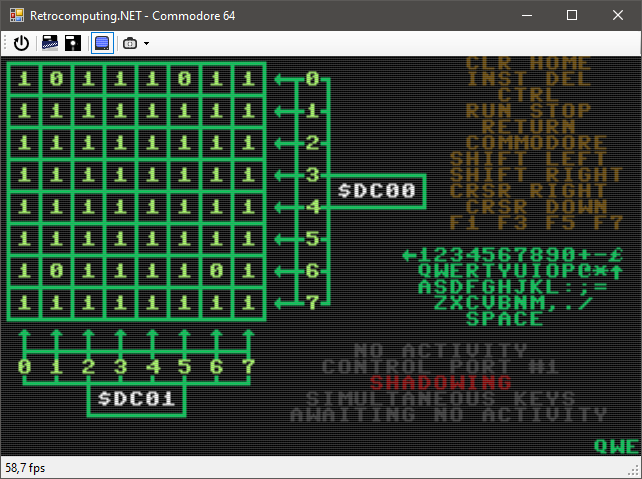
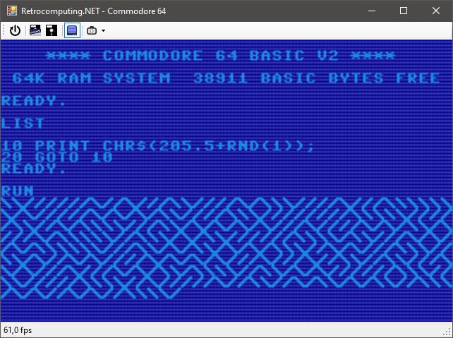
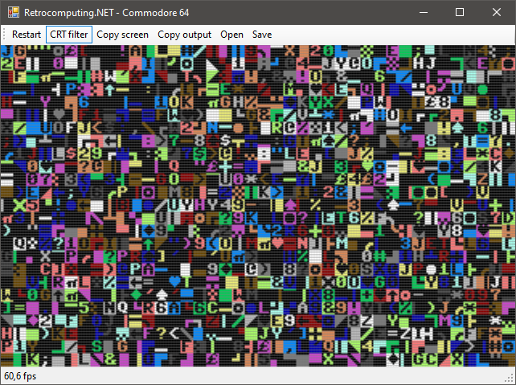
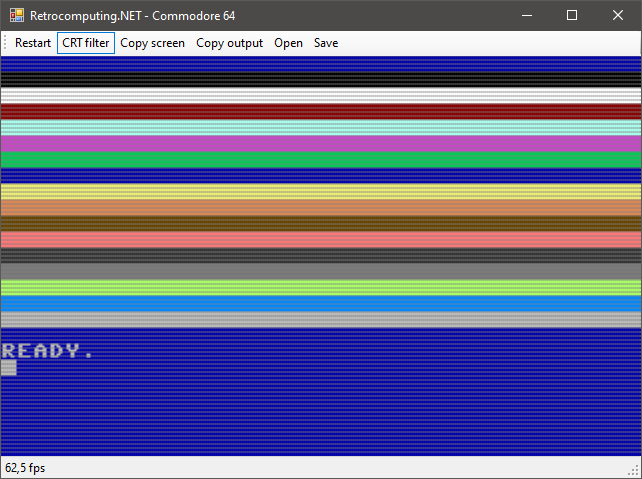

# Commodore 64 Emulator

One of the main goals of this project was to be able to run the **C64 KERNAL-** and **BASIC-ROM** on the **6502**. **BASIC** was one of my first introductions to programming and seeing that **`READY.`** prompt on my own C64 emulator so many years later was extremely pleasing. 😁

## Features / Roadmap

- [x] Loads the **KERNAL-**, **CHARACTER-** and **BASIC-ROM**
- [x] Boots into **COMMODORE 64 BASIC V2**
- [x] Simple character buffer view (with limited input possibilities)
- [x] Able to input BASIC program and run
- [x] Proper input/keyboard mapping
- [ ] VIC-II emulation
  - [x] Standard Character Mode
  - [x] Multi Color Character Mode
  - [ ] Standard Bitmap Mode
  - [ ] Multi Color Bitmap Mode
- [ ] SID emulation

## Progress Screenshots

*Most recent screenshots first*.

> Refined UI with more toolbar items, support for attaching `.crt`-file cartridges, change clock speed, debug tools for the VIC-II, improved status bar and a new CRT look.
---

> Keyboard matrix implemented. In this screenshot I'm running the [Keyboard IO Routine V2.5](https://csdb.dk/release/index.php?id=120949) test program.
---

> Some GUI-updates and the "maze"-oneliner running.
---

> I find these random characters really beautiful.
---

> I'm currently working on the UI. I added a tool bar with some commands and moved the fps-counter into a status bar. In this screenshot I have opened the `color_bars.prg` program and executed it.
---

> Preview of the second version of the C64 emulator running **COMMODORE 64 BASIC V2** and a simple BASIC program. This video output is using the CHARACTER ROM which is why it looks more like the real thing. Keyboard mapping is also improved in this version. And memory mapping is working as expected too, as we can tell from the `38911 BASIC BYTES FREE`-message!
---

> BASIC Program to print color bars on screen.
---

> Output of BASIC program above.
---

> Preview of setting another background color by using the `POKE 53281,2` command.
---

> Preview of the first version of the C64 emulator running **COMMODORE 64 BASIC V2** and a simple BASIC program. This video output isn't using the CHARACTER ROM.
---