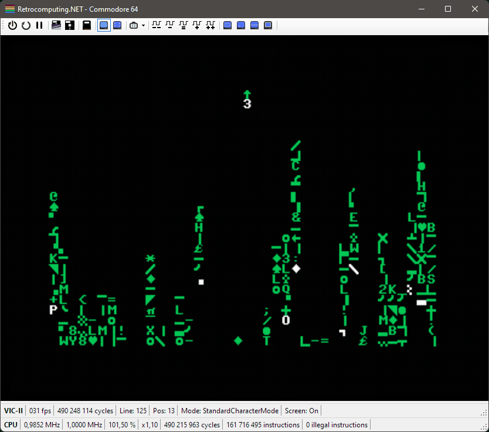

# Retrocomputing.NET

**❗ Disclaimer:** This is a hobby project intended for educational purposes only! Feel free to submit issues, but don't expect them to be fixed. Pull requests will not be accepted.

## About

This hobby project contains software implementations of old microprocessors and complete computer systems. I'm very interested in retrocomputing and this is how I learn about the inner workings of these old, classic and amazing computers and game consoles. 🤓🕹💾

## Contents

### Microprocessors

#### [MOS Technology 6502 8-bit microprocessor](MicroProcessor/Cpu6502)

### Computer Systems

#### [Commodore 64 Emulator](ComputerSystems/Commodore64)

*My Commodore 64 emulator running my version of `cmatrix` for the C64; `c64matrix`:*

