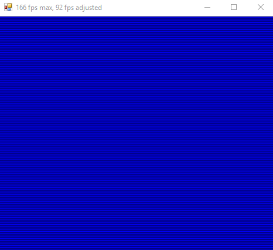

# Retrocomputing.NET

## About

#### ❗ This project exists only for educational purposes! ❗

This project contains software implementations of old microprocessors and old computer systems. This is a hobby project for educational purposes. I'm very interested in retrocomputing and want to learn as much as possible about the subject. 🤓🕹💾

## Contents

### MOS Technology 6502 8-bit microprocessor

> *"The **6502** and variations of it is used in many of the old home video game consoles and computers, such as the Atari 2600, Atari 8-bit family, Apple II, Nintendo Entertainment System, Commodore 64, Atari Lynx, BBC Micro and others."*

I've always wanted to write my own implementation of this legendary chip and that's why this project exists. The main goal was to get the **6502**-implementation working and being able to run **Commodore 64 BASIC** on it. That goal has been reached, but the work continues on implementing more parts of these old computer systems, such as the **SID**-chip, the **VIC-II** chip and the **PPU**-chip.

I implemented the 6502 in about a weeks worth of late nights, including testing and bug fixes. I tried to use original and reverse engineered documentation rather than looking at other software implementations so that I would learn as much as possible about every part of the chip. I did however look up logic from different software implementations when I had specific bugs that I couldn't figure out after spending a lot of time debugging.

#### Features
- [x] C#.NET implementation of the **MOS Technology 6502** 8-bit microprocessor
- [x] Simple debugger with memory view/watches
- [x] All official/legal instructions tested by running `nestest.nes` and comparing to the golden log from `Nintendulator`
  - https://wiki.nesdev.com/w/index.php/Emulator_tests#CPU_Tests
  - http://www.qmtpro.com/~nes/misc/nestest.txt
  - http://www.qmtpro.com/~nes/misc/nestest.log
- [ ] Cycle perfect emulation
- [ ] Decimal mode

---

### Commodore 64 "Emulator"

One of the main goals was to be able to run the **C64 KERNAL-** and **BASIC-ROM** on the **6502**. **BASIC** was one of my first introductions to programming and seeing that **`READY.`** prompt on my own C64 emulator so many years later was extremely pleasing. 😁

***Preview of the second version of the C64 emulator running **COMMODORE 64 BASIC V2** and a simple BASIC program. This video output is using the CHARACTER ROM which is why it looks more like the real thing. Keyboard mapping is also improved in this version. And memory mapping is working as expected too, as we can tell from the `38911 BASIC BYTES FREE`-message!***

#### Features

- [x] Loads the **KERNAL-**, **CHARACTER-** and **BASIC-ROM**
- [x] Boots into **COMMODORE 64 BASIC V2**
- [x] Simple character buffer view (with limited input possibilities)
- [x] Able to input BASIC program and run
- [x] Proper input/keyboard mapping
- [x] Real character mode output by using the CHARACTER GENERATOR ROM
- [x] Character mode output with char color data
- [ ] VIC-II emulation? (probably never)
- [ ] SID emulation? (hopefully)

#### Screenshots

***BASIC Program to print color bars on screen.***

***Output of BASIC program above.***

***Preview of setting another background color by using the `POKE 53281,2` command.***

***Preview of the first version of the C64 emulator running **COMMODORE 64 BASIC V2** and a simple BASIC program. This video output isn't using the CHARACTER ROM.***

